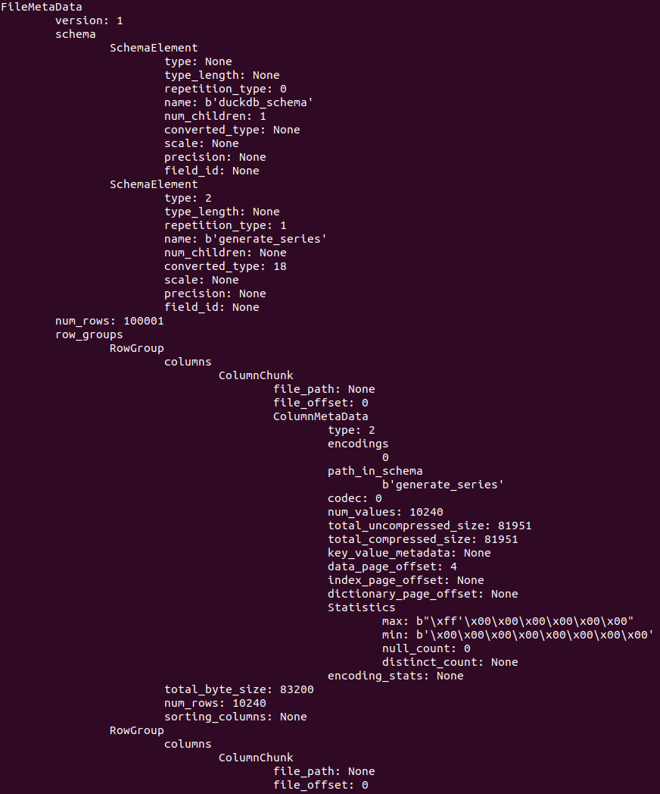

# parquet-inspector

A python-script for inspecting the metadata& contents of a .parquet -file (really for learning about the file format).

The script will print the metadata of the parquet file as-is. 

\*\***NOTE**\*\*: At the moment (and probably forever) only uncompressed files and plain encodings are supported. Also only ints, floats and strings (= bytearrays) are supported.

## How to

Install requirements (thrift):

    pip install -r requirements.txt

It's easy:

    python3 $parquet-file-path $number-of-records

where `parquet-file-path` is a path to a *single* parquet-file (not a folder) and `number-of-records` is an (optional) number of records to print from each row-group & column.

## Example

Use the [DuckDB livedemo](https://shell.duckdb.org/) and create a parquet-file like so

    COPY (FROM GENERATE_SERIES(100000)) TO 'row-groups.parquet' (FORMAT PARQUET, CODEC 'UNCOMPRESSED', ROW_GROUP_SIZE 10000);

And download it

    .files download row-groups.parquet

Then, running python3 row-groups.parquet will give something like this (all rowgroups are not included)

## Recompiling thrift idl

Because Parquet metadata is serialized with [Thrift Compact Protocol](https://github.com/apache/thrift). If you wish to recompile the thrift IDL (you don't need to as the compilation result is included in the source), you need to install the thrift-compiler to compile the parquet-specification to python. Install it and run `source compile_thrift.sh`. 

